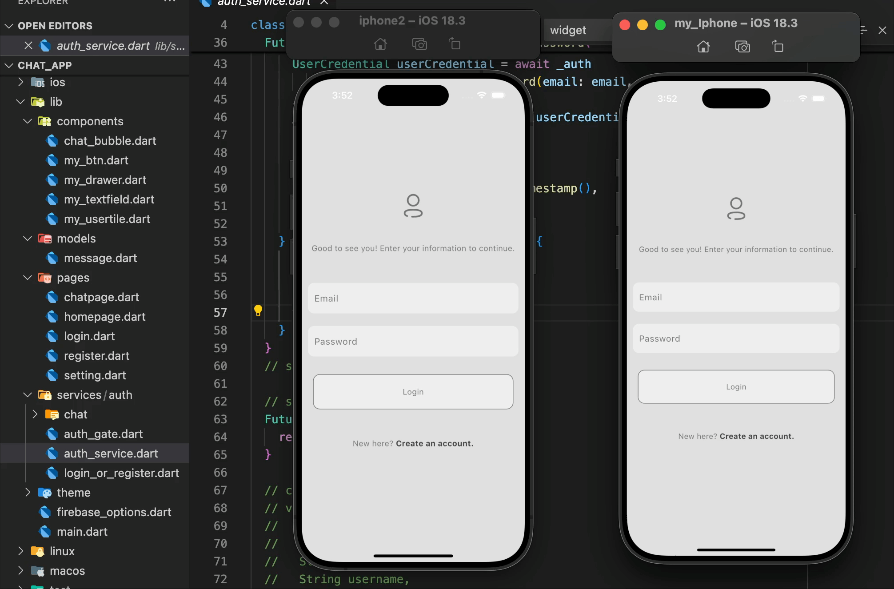

# CHAT APP

Introducing my new Firebase-based Chat App, a real-time messaging application built with Flutter and Firebase. This app allows users to sign up, sign in, and instantly connect with others through a clean and intuitive user interface.

Upon creating an account, each user gets a personal profile that can be used to initiate chats with other registered users. The app displays the last message preview in the chat list, making it easy to follow up on recent conversations.

Key Features:
	•	 User Authentication (Sign Up / Sign In) using Firebase Auth
	•	 Real-time Chat functionality powered by Firebase Firestore
	•	 User Profiles created at registration for personalized chatting
	•	 Light/Dark Theme Support managed by the Provider package and hive
	•	 Data Persistence to save and manage user data effectively
	•	 Simple and Responsive UI for a smooth user experience
	•	 Last Message Preview to help users track conversations easily

#  Technologies Used
• Flutter (Dart)
• Provider (for state management)
• Flutter firebase
• Flutter hive_ce & hive_ce_flutter

#  Screenshots

## 📌 Feel free to contribute, fork, and give a star ⭐!
